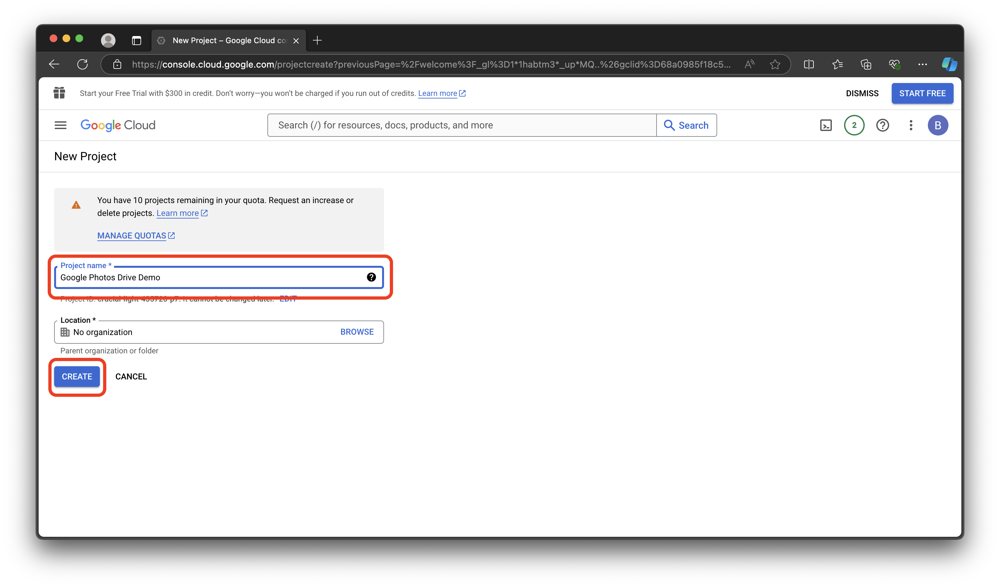
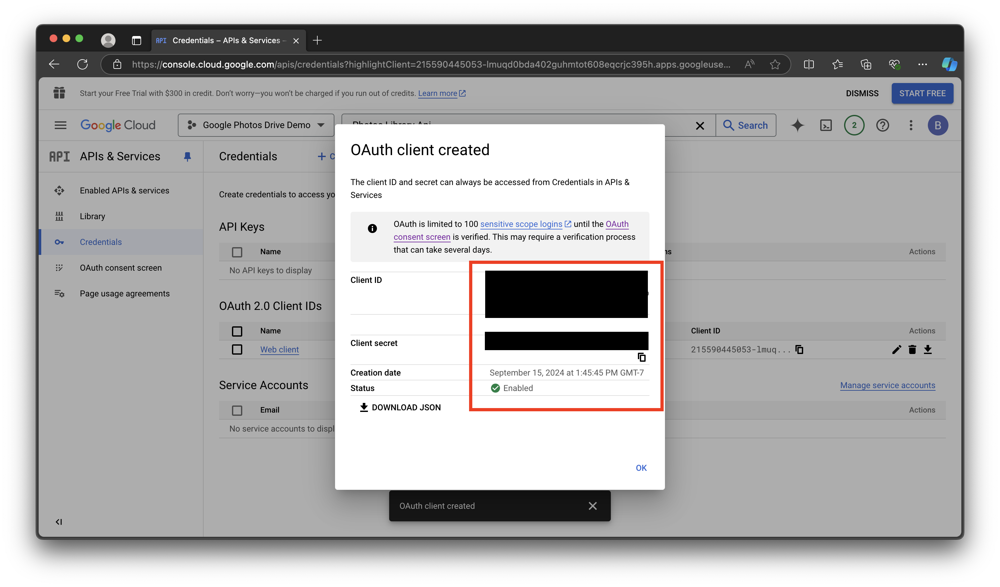

# Setting up OAuth2 on Google

## Description

This document outlines how to create your own OAuth2 client ID and client secrets so that you can interact with the Google Photos APIs.

## Steps

1. Go to <https://cloud.google.com/cloud-console> and log into your Google account.
2. Click on the "Console" button:

    

3. Click on the "Select Project" button and create a new project with any name:

    

    

    

4. Wait for the project to be created. Then, select your project again:

    

    

5. Type in "Photos Library Api" in the search box, select "Photos Library Api", and click on "Enable":

    

    

6. Create a new OAuth2 Consent Screen by going to to the APIs and Services tab, selecting OAuth Consent Screen, creating an External API, and fill in the details:

    

    

    

    

7. We don't need special scopes. So we can click on the Save and Continue button in the special scopes page:

    

8. In the Test Users page, click on Save and Continue. We don't need to add test users since we will publish the app:

    

9. Now, publish the app:

    

    

10. Create the Client IDs and client secrets by going to the "Credentials" tab, clicking on "Create Credentials", select "OAuth Client ID", selecting "Web Application", and adding <http://localhost:4200/auth/login/callback> in the authorized redirect uri:

    

    

    

    

    

11. Finally, click on the Create button. A dialog will appear with your Client ID and Client secrets. Copy the client ID and client secrets in a note pad.

    
